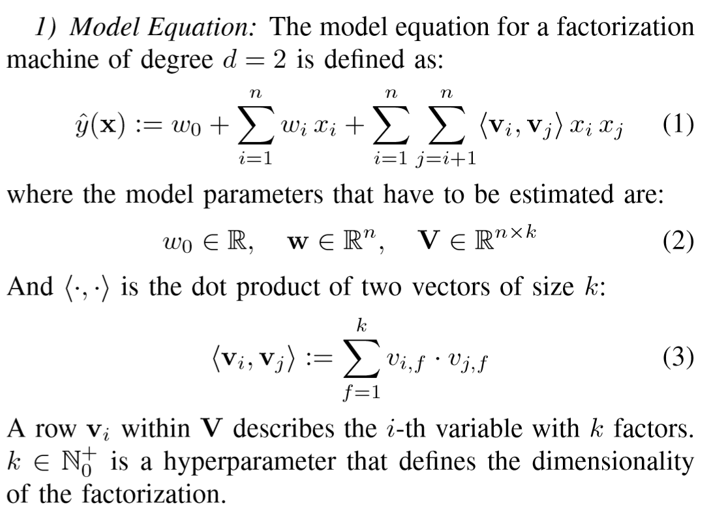
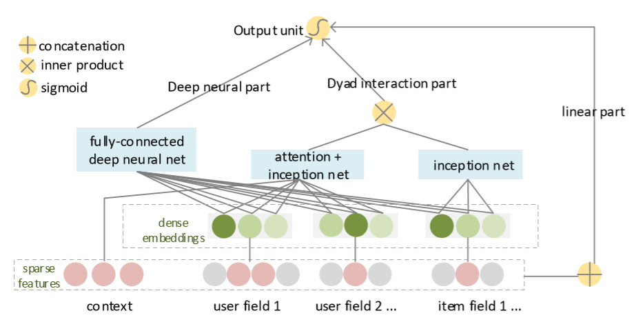
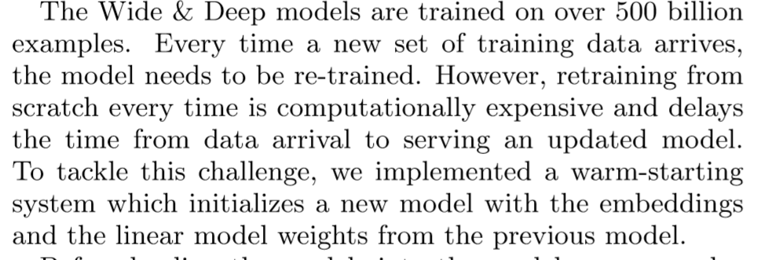

:smile:
[TOC]
## 结构
- Codes：复现的代码    
- Notes：论文笔记
- Papers：论文
- Resources：论文截图

## 声明
- 要引用、转载，请附本仓库链接[https://github.com/namespace-Pt/News-Recommendation]

## Highlight
- 黄：需要看的点
- 蓝：看懂后自己提醒的需要注意的点
- 绿：不认识的单词
**在[45]之后黄色代表不认识的单词，绿色代表需要看的点**

## Glossary
- Jaccard:给定$x = (1,0,0),y=(0,0,1)$，则
  $$Jaccard(x,y) = \frac{|x\cap y|}{|x\cup y|} = \frac{1}{2}$$
- Access partern：点击同一个文章的不同用户的分布
- $u$、$v$是$n$维行向量：
  - inner product$ = u^Tv$
  - outer product$ = uv^T$
- Click Through Rate(CTR):$CTR = \frac{clicked}{viewed}$
- i.i.d: independent and identically distributed，独立同分布
- lookup (table):设$W \in \mathbb{R}^n*m$为用户的lookup table，一行对应一条embedding，$u$的embedding为$W[u]$，一般随机初始化或者预训练得到
- Co-visitation[1]，记录用户点击过当前article后又点击了哪些，之后点击的每一篇以衰减的时间为权重；即维护一个图，节点是所有article，边代表co-visitation，即任一个用户点击i后点了j，就把i->j连一条边，边的权重会随时间衰减
- Hadamard product：element-wise product over 2 vectors of the same size
- Confusion Matrix
  - TP
    - TPR(sensitivity)
  - FP: false positive, means false determine on False Example (classified to True)
    - FPR(specificity)
  - FN: false negtive, means false determine on True Example (classified to False)
## Blogs
- [Q-Learning](https://www.mlq.ai/deep-reinforcement-learning-q-learning/)
- [CNN](https://towardsdatascience.com/a-comprehensive-guide-to-convolutional-neural-networks-the-eli5-way-3bd2b1164a53),[CNN_torch](https://towardsdatascience.com/pytorch-basics-how-to-train-your-neural-net-intro-to-cnn-26a14c2ea29)
- [Transformer](http://jalammar.github.io/illustrated-transformer/)
- [LSTM](https://colah.github.io/posts/2015-08-Understanding-LSTMs/)
- [Layer Normalization](https://mlexplained.com/2018/01/13/weight-normalization-and-layer-normalization-explained-normalization-in-deep-learning-part-2/)
- [Mathematics for Machine Learning](https://mml-book.github.io/)

## Toolkits
- NLP工具：GATE
- libFM

# 新闻推荐
## Notation
- 接受推荐的用户记为$u$，某一新闻记为$v$

## 目标
给定用户$u$，新闻集$\mathcal{V}$，从$\mathcal{V}$中选出前$k$个用户最有可能点击的新闻，推荐给用户
  - 最大化click through rate（CTR）

## 新闻推荐的特点
- **Large scale**：用户和新闻数量都很大，新闻更新快

- **Sparse**：很多用户看很少的新闻，使其特征稀疏

- **Dynamic**：用户的兴趣一直发生着变化

- **No query**：人们来看推荐很少会抱有特定的信息诉求，而是show me something interesting

- **No explicit feedback**：难以得到用户的显示反馈，只有点击数据

- **No heterogeneous context**：MIND数据集不提供用户的地理位置、搜索记录等信息

## 梳理
关于推荐，首先有**基于user-item矩阵的协同过滤(Collaborative Filtering)**，最基础的memory-based协同过滤要求计算user的**两两之间相似度**，计算量很大，于是在其基础上发展了各式各样**减小运算量**的办法（model-based）：聚类和使用隐空间；聚类将相似的用户聚集在一个cluster内，之后再给$u$推荐时只需要考虑其所在cluster内部的其他成员爱看哪些article，也可以通过概率的办法计算用户和article的分布；隐空间则是通过分解user-item矩阵，将user和article投射到同一个隐空间中，可以直接计算向量内积、cos夹角等方法评价user、article的相似度；
协同过滤没办法推荐新内容（没人点击），冷启动问题严重，不适用于新闻推荐的场景，因此提出了**基于内容的推荐**；而且矩阵分解等办法一旦加入新user、article就得重新训练，且需要人工feature engineering，因此提出了**Factorization Machine**。
基于内容的推荐主要有以下几步：
  1. **将article表示为一个向量（representation）**，即将article投射到**语义空间（semantic space）**，然后根据用户的浏览历史将用户也投射到语义空间（**user profile**）
  2. 召回符合user profile的article，初步选出一个大集合$\mathbb{S}$
  3. 用更精确的article representation和user profile计算article的评分（rating），根据此评分对$\mathbb{S}$中的元素进行排序（ranking）

新闻推荐的目的更单纯，就是想**增加Click Through Rate（CTR）**，由此可以使用评分来模拟用户点击新闻的概率，然后**让用户真正点击的新闻（training data）对应概率最大**
## Collaborative Filtering
  - **在user-item矩阵及其衍生品基础上进行计算**
  1. 按照方法来分：
  - memory-based：
    - 根据用户历史记录，计算用户之间两两之间相似度(Jaccard)，以此作为权重，对u的推荐结果就是其和剩余n-1个用户的历史记录加权平均得到的向量中分数大于某一阈值的对应article
    - 对用户历史记录全是线性加权求和，显然没有考虑用户兴趣的变化等等因素[8]
    - 要算user两两之间的相似度，计算量太大，使用不同方法减少运算量：MinHash+LSH[1]，除了这样的trick外，提出model-based

  - model-based：
    - neigbor：
      - 使用kmeans、hierarchical clustering[2,6]等方法将用户进行聚类，用$u$在各个类别的fractional membership来表示$u$，推荐时计算$u$和预先定义的$m$个类之间的相似度，将其作为权重进行和整个类用户的平均历史记录加权平均得到结果，极大减少计算量
      - 最后评分还是加权求和，没有考虑兴趣变迁等等
    - Matrix Factorization：
      - 分解user-item矩阵，将用户和article都映射到一个隐空间（$R^{K}$）中，用户有其特征向量$p_u$，新闻有其特征向量$q_v$，所有用户对所有article的平均值是$\mu$，$u$的偏置是$b_u$，$v$的偏置是$b_v$，则用户$u$对于新闻$v$的评分为 $$r = b_{uv} + p_u^{T}\cdot q_v\\ b_{uv} = \mu +b_u+b_v$$
      - 可以自然地捕捉到显示信息和隐藏信息，$q_v$的第$i$个维度代表$v$在第$i$个factor上的从属信息，越大代表越属于（相关），$p_u$的第i个维度代表$u$对第$i$个factor的感兴趣程度，越大越感兴趣，其中$p_u$和$q_v$都可以携带额外信息，并且作为时间的函数[9]；
      - 每次加入新的用户、新的新闻都得重新算，效率极低；在user-item矩阵稀疏的情况下效果差，如果只考虑出现1的列，那么会导致过拟合[9]；同时计算复杂度高[10]
    - 基于概率的分解：
      - PLSI[1]
      - 假设用户和新闻的分布，用隐变量来模拟用户和新闻之间的联系，将用户和新闻聚类在多个高斯分布上，本质上我认为还是将用户和新闻映射到一个隐空间中
      - 推荐时直接计算$p(v|u) = \sum_z p(v|z) * p(z|u)$
      
    - Factorization Machine：
      - 将*user-item*矩阵转化为*transaction-attribute*矩阵，一行为一条交互记录，列为不同的属性，将用户id和新闻id都作为属性（独热、*多热*表达），每一条交互记录都对应一个用户最终的评分（点击概率）
      - 得到一个$V\in R^{n*k}$，每一行对应一个属性，即将每一个属性嵌入到$R^k$中，得到属性的feature
      - 输入transaction，映射为feature，输出该条transaction对应用户给对应article的评分rate
      - 时间复杂度$O(n)$
  2. 按照对象来分：
  - user-oriented：
    - 计算用户之间的相似度，进行上述的聚类等
    - 给$u$推荐与其相似的用户爱看的新闻
  - article-oriented：
    - （计算article之间的相似度），进行上述的聚类
    - 给$u$推荐与其看过的新闻相似的新闻

## Content Filtering
  - **在word-doc矩阵及其拓展上进行计算**
  - 按步骤描述[11] 
### 1. 表达新闻（representation）
  - Term-based[3]
    - n-gram[11]
    - 1-D CNN with window size of n(n-gram)[17]
    - search[43]
  - topic/category-based[5,6]
    - 矩阵分解（SVD、LSI等）
    - 基于概率的矩阵分解（PLSA、LDA等）效果不好因为使用无监督的训练方法（EM等），这种训练方式的损失函数和提升infomation retrieval并无太多联系[13]       
    - n-gram配合全连接神经网络+tanh[13]
  - entity-based
    - 利用title中的实体作为complement[4,24,33]
    
  - embedding-based
    - denoising auto-encoder[8]
    - attention
      - self-attn，建模词和词之间的联系，权衡词的重要性
      - multi-view attn，建模各模块之间的联系，如标题和类别，权衡其重要性
      - co-attention[27,41]
        - 在用户和文档是用同一个单元表示的时候（e.g.用户是一组实体，article是一组实体，两者个数相同）
        - 构建矩阵$M\in \mathbb{R}^{d*d}$计算用户单元和article单元的两两之间相似度，每一行argmax找到与用户最相关的**一个**单元
        - 常与view配合，因为一个大view下可能有好多个小view，首先选出最相关的大view
        - softmax后选出最大的不可导，因此使用*Straight-ThroughGumbel-Softmax*
        - 可以使用不同的*Gumbel Noise*运行多次，得到多种不同的结果（选出多个）
    - CNN[20-24,31,34]，可以捕捉*local text*
    - 将文章的信息**投射/分解**到多个不同的空间[29,31]
      - 空间之间彼此不同，因此能尽可能地包含更多信息
        - [29]用不同级别膨胀率的HDC提取文章信息，每一个膨胀率对应一个空间
        - [31]使用多个pooling head将用户信息投射到和每个pooling head相关的空间中，使用pooling head之间的正交性保证其不重合
        - [39]使用k个不同的fead-forward(RELU)映射到不同的隐空间中，使用[preference regularizer](Notes/39.md)确保k个隐空间之间不重合
        - [40]基于product quantization提出[recurrent composite encoding](Notes/40.md)，让第$l$个隐空间学习$input-\sum_{i=0}^{l-1}y^i$
  - attribute-based
    - 将用户和article的信息拉成一行，每一个attribute都对应若干列，单个属性的向量是独热表达的，可以参考FM的那张图，随机初始化后为每一个属性学习得到一个repr[11]
    - 结合FM和DNN[16]
    - Wide&deep[11]
  - graph-based
    - 一个session内构建co-visitation graph，sequential预测用户下一个点击的article[38]
    - 构建user-item的二部图[37,39]
      - 利用邻居节点的信息表示自身[37]
      - GNN[39]
    - 直接将article作为实体构建知识图谱[32]
      - 利用邻居实体（article）的信息完善自身表示，同时将用户对某一条边的兴趣作为权重
      - 新闻推荐中应该不适用，更新太勤了，动态维护图应该还挺麻烦
  - extra-infomation(meta-data[17])
    - location
    - popularity[6,18]
    - recency[6,18]

### 2. 根据用户历史记录中的新闻来建模用户（user profile）
- **各种方法和news representation中差不多**
  - MLP[33]
    - 直接把用户id等特征映射到隐空间
  - RNN[8,26]
    - 长短期画像
    - 考虑时间间隔，优化LSTM[26]
  - attention[20,22,23,26,27,28]
    - multi-view[21,26]，计算不同domain信息之间的interaction（比如用户浏览的title和body之间的）
    - self-attn[22]，计算词和词之间的联系
    - personalized-sttn[23]，用户id的embedding作为query，匹配合适的权重
  - 基于transaction[16,18,27]
    - 有多个field，包含多种信息，将各种信息使用神经网络结合
  - 基于图
- 附加
  - 考虑当下热点[5]
    - 用一段时间内发布某一category的新闻数除以总发布新闻数表示$p(c_i)$，代入贝叶斯模型，计算$p(c_i|click)$即给定用户点击事件，article属于各个category的概率，用最大的给推荐
  - 考虑用户兴趣衰减[8]
  - Heterogeneous Aggregation
    - 和$u$相似的用户[6]
    - location[5]
    - 搜索记录，浏览的网页[34]
    - review[41]
### 3. 从新闻集合中选取匹配user profile的新闻（infomation retrieval），一般考虑的特征比较少，比较粗糙
  - 将多种特征赋以不同的权重[6]
  - user-item矩阵分解做内积，ANN减少运算[18]
  - Co-visitation[1]，记录某一篇article被点击后，用户还点击了哪些article
    - 维护一个图，节点是所有article，边代表co-visitation，即任一个用户点击i后点了j，就把i->j连一条边，边的权重会随时间衰减
### 4. 对候选集中的新闻评分，根据评分生成推荐（ranking/rearrange），考虑更细致的特征
- 基于期望
  - contexual bandit[2]，将从候选集中选取新闻看做n-arm bandit问题，一方面要长期地让用户满意（最大化CTR），另一方面要在当前状态多探索，获得用户对不同类型新闻的反馈
  - markov决策序列
- 基于贪心
  - submodularity:budgeted maximum coverage[6]，建模为背包问题
- 基于logistic回归
  1. 计算user-item相似度relevance：
    - 内积
      - 计算相同隐空间下的用户feature向量和新闻feature向量内积计算相似度，之后通过sigmoid得到概率[8,20-24]
      - 内积最有效率[20]       
    - cosine[13,17]
      - 计算user隐向量和article隐向量之间的cos相似度
    - Neural[11,16,18,26,29]
      - 给定$x$同时包含了用户和article的信息，则$y=w^T x + b$
  2. 基于relevance估计user点击article的概率
    - Sigmoid
      - $\hat{p} = \sigma(r)$
    - Softmax
      - $\hat{p} = \frac{e^{r^+}}{\sum_{k=0}^{K}e^{r^-} + e^{r^+}}$
      - 用relevance的softmax得到概率，分母是用户没看的k篇新闻[13]（最好是在当前minibatch中别的用户看了这些）+看了的当前新闻，以及如果当前minibatch中不够，那么选热门新闻，帮助模型区分热门新闻和用户兴趣[19]，或者选当前session中系统呈现出来但用户没有点击的新闻[20]）
  3. 目标是最大化点击概率（label=1，等价于CTR），*loss function*可以是：
    - 多分类（极大似然函数/Cross-Entropy Loss），在多个新闻中点击一个[11,13,16,18-23,27]
    - 二分类，针对一个新闻，使用二元logloss[26,31,38,39]
      - 难以考虑负例的信息，在其上改进[30,32]
      - 随机均匀/非均匀采样负例[45]
- multi-task
  - 在进行新闻推荐的同时完成别的任务，不同任务之间共享新闻表达向量
  1. 新闻分类[17,35]
      - 利用得到的新闻表达向量训练分类器进行新闻主题识别
  2. 生成解释[27,41]
      - 告诉用户为什么给他推荐这个，提升信任并促使用户点击
  3. 知识图谱
      - 给定头实体的表达，关系的表达，预测尾实体[33]
- metric learning[46]
  - 将用户、item、点击事件嵌入到同一个空间
  - 使用矢量距离计算item分值
- 要考虑的点
  - 剔除相似内容的新闻，每一次呈现给用户的新闻列表要diversify，相似内容的新闻不要出现在一次推荐结果中[6]

## Hybrid
- 同时利用user-item矩阵和semantic、context信息

## Trick
- word-doc矩阵初步降维
  - word hashing[13]
- sample
  - 随机的挑选
  - 应该将是否存在新用户的情况分开讨论对比

## 训练
- 要搞明白目标是什么，objective function和目标要对应，如果使用聚类的目标函数做出来的模型去ranking，肯定效果差
- 训练GRU和LSTM时gradient clipping[8]
- 多个机器并行，使用热启动解决每次加入新用户需要重新训练的问题[11] 
- 模型初始化权重时，可以更加精确[15] 
- 模型中采用20%的dropout防止过拟合[20]
- 为了防止梯度下降或者梯度爆炸，使用layer normalization[29]
- [30]提出了新的loss function，可以将负例的影响纳入到二分类logloss中
- 好像可以从一个参数矩阵中derive出另一个，一起训练，没太懂，详见[40]
- 防止梯度消失/梯度爆炸：layer normalization

## 评测
- CTR = $\frac{clicked}{viewed}$，越大越好
- AUC、MRR、nDCG；越大越好[8]但我感觉吧，nDCG没啥用，因为用户推荐的时候只会点开一个新闻，看完再返回来就应该根据用户历史生成新的新闻了
- HitRate@k:假设$u$点击过的新闻集合$A$，得到的推荐列表（集合）为$R$，$|R| = K$，则$$HR@K = \frac{|A\cap R|}{|A|}$$
- 要在99%置信区间的t检验下合格[7]
- 在线评测[17]，用当前session的数据训练，下一个session中的数据预测
- 可以对比各个超参数对模型的影响，包括
  - 激活函数（RELU，tanh，sigmoid）
  - 每一层的神经元个数（100 200 400）
  - 隐层的维度
  - 模型的形状

## 我觉得很好的文章
[13,26,48]
## 文献索引
[1] Google News Personalization Scalable Online Collaborative Filtering  
[2] A contextual-bandit approach to personalized news article recommendation  
[3] Content-Based News Recommendation  
[4] Personalized News Recommendation A Review and an Experimental Investigation  
[5] Personalized news recommendation based on click behavior  
[6] SCENE A Scalable Two-Stage Personalized News Recommendation System  
[7] Content-based Collaborative Filtering for News Topic Recommendation    
[8] Embedding-based news recommendation for millions of users  
[9] Matrix factorization techniques for recommender systems  
[10] Factorization Machines  
[11] Wide & Deep Learning for Recommender Systems  
[12] Maximum Likelihood, Logistic Regression, and Stochastic Gradient Training  
[13] Learning deep structured semantic models for web search using clickthrough data  
[14] Combining Content-Based and Collaborative Filtering in an Online Newspaper  
[15] Neural Networks: Tricks of the Trade (Second edition)  
[16] Deepfm afactorizationmachine based neural network for ctr prediction  
[17] News session based recommendation susing deep neural networks  
[18] Towards better representation learning for personalized news recommendation a multi-channel deep fusion approach  
[19] Session-based recommendations with recurrent neural networks  
[20] Neural News Recommendation with Attentive Multi-View Learning  
[21] Neural News Recommendation with Long- and Short-term User Representation  
[22] Neural News Recommendation with Multi-Head Self-Attention  
[23] Npa Neural news recommendation with personalized attention  
[24] DKN Deep Knowledge-Aware Network  
[25] DRN A Deep Reinforcement Learning Framework for News Recommendation  
[26] Adaptive User Modeling with Long and Short-Term Preference for Personalized Recommendation  
[27] Co-Attentive Multi-Task Learning for Explainable Recommendation  
[28] Explainable Recommendation through Attentive Multi-View Learning  
[29] Fine-grained Interest Matching for Neural News Recommendation  
[30] Geography-Aware Sequential Location Recommendation  
[31] Hi-Fi Ark Deep User Representation via High-Fidelity Archive Network  
[32] Knowledge Graph Convolutional Networks for Recommender Systems  
[33] Multi-Task Feature Learning for Knowledge Graph Enhanced Recommendation  
[34] Neural News Recommendation with Heterogeneous User Behavior  
[35] Neural News Recommendation with Topic-Aware News Representation  
[36] Personalized Multimedia Item and Key Frame Recommendation  
[37] Reviews Meet Graphs Enhancing User and Item Representations for Recommendation with Hierarchical Attentive Graph Neural Network  
[38] Session-Based Recommendation with Graph Neural Networks  
[39] Graph Neural News Recommendation with Unsupervised Preference Disentanglement  
[40] LightRec A Memory and Search-Efficient Recommender System  
[41] Towards Explainable Conversational Recommendation  
[42] Knowledge-Aware Document Representation for News Recommendations  
[43] Combining Collaborative Filtering and Search Engine into Hybrid News Recommendation    
[44] Collaborative Metric Learning with Memory Network for Multi-Relational Recommender Systems  
[45] Sequential Recommendation with User Memory Networks  
[46] Leveraging Demonstrations for Reinforcement Recommendation Reasoning over Knowledge Graphs   
[47] EntityDuet Neural Ranking Understanding the Role of Knowledge Graph Semantics  
[48] Octopus Comprehensive and Elastic User Representation for the Generation of Recommendation