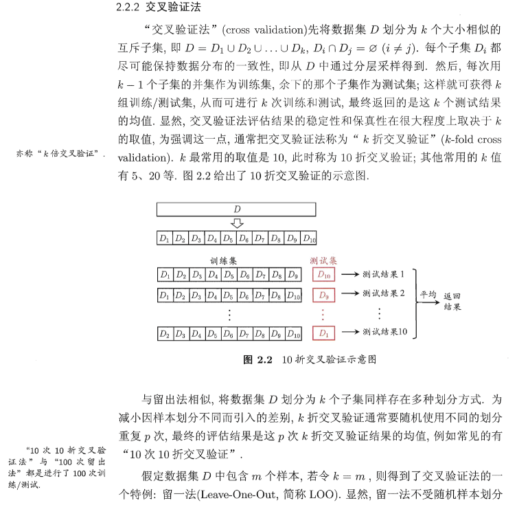
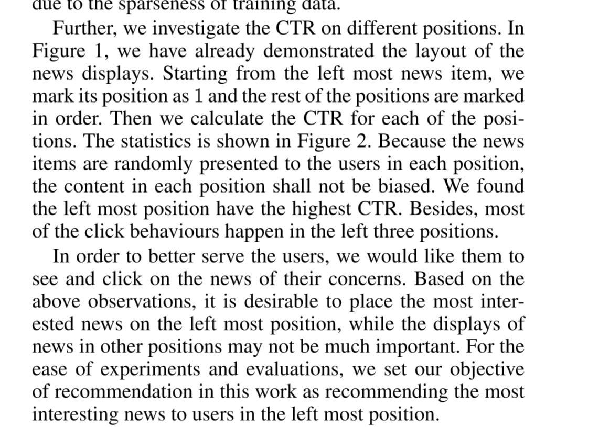
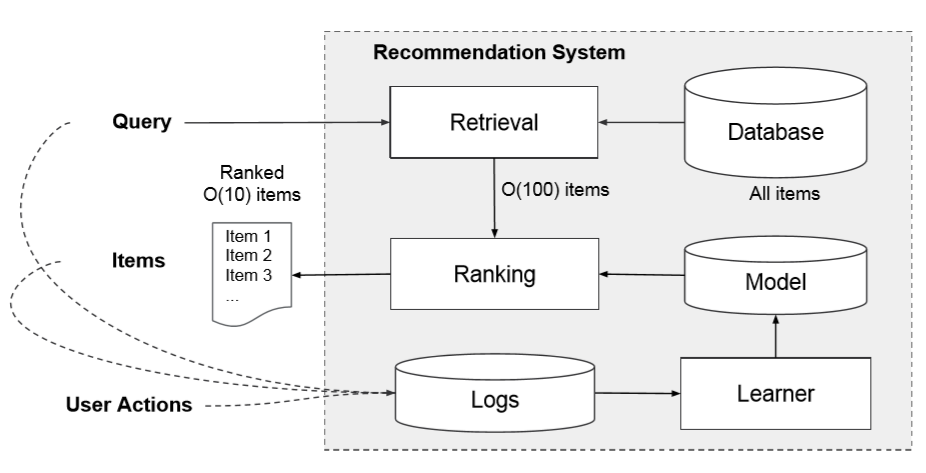
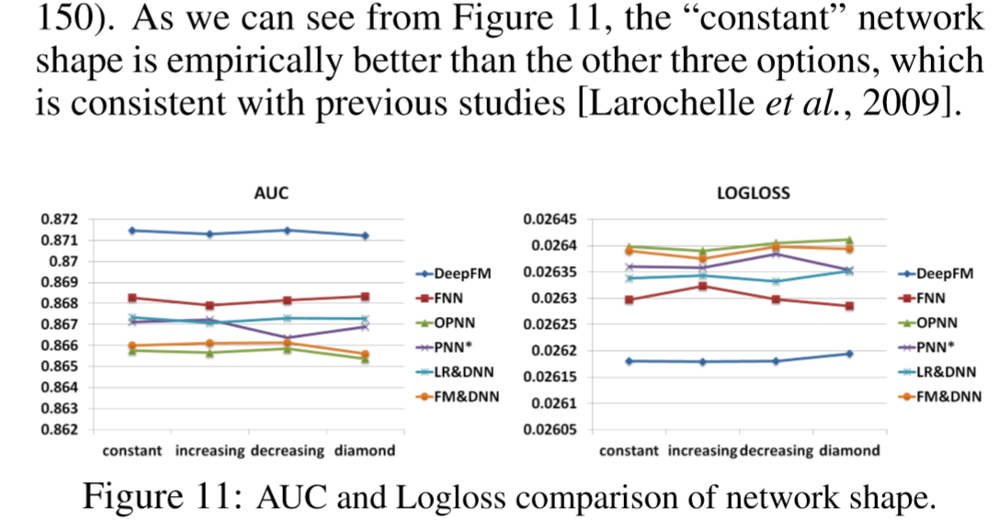
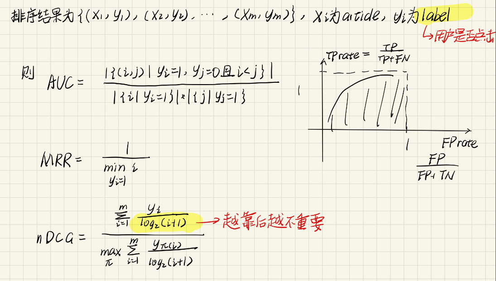

## Highlight
- 黄：需要看的点
- 蓝：看懂后自己提醒的需要注意的点
- 绿：不认识的单词
## 要看
- HRNN那篇
- 新出的Bandit
- [2]重新看一下
- Reinforcement learning

## Glossary
- Access partern：点击同一个文章的不同用户分布*之类的东西*
- cross-validation 
- inner product and outer product, $u$和$v$都是$n$维向量：

## 问题索引
- [18]没看完
- [20]中attn的query是什么？？？上升一下，**RS中的query是什么？？**
- SVM和Fisher什么鬼的[15]
- 像极大似然法这种东西，它是把所有样本集输出都算出来后才能计算loss，那么对优化参数有没有影响呢？
- 倒排索引

## Toolkits
- NLP工具：GATE
- libFM

## Notation
- 接受推荐的用户记为$u$，某一新闻记为$v$

## 目标
- 可以看做是将用户最喜欢看的新闻推荐到最前面
- maximize CTR[16]
- 最大化用户点击的次数的期望[2]

## 新闻推荐的特点
- 数量大
- 文章更新快，item频繁更新
- 很多user看很少的新闻，使其特征sparse[17]
- 人们来看推荐很少会抱有特定的信息诉求，而是“show me something interesting”[14]
- 最好不要explicit获取用户profile，很多人不愿意
- 用户的兴趣随着打开相似新闻而衰减
- 应该考虑两种session：
  - 用户点开一篇新闻后回来，得到和点开新闻前不同的推荐列表
  - 用户需要手动刷新，得到推荐
  - User’s current interest in a session may be affected by his context(e.g.,location,accesstime) or by global context(e.g.,breaking news or important events)[17].

## Collaborative Filtering
  - **在user-item矩阵及其衍生品基础上进行计算**
  1. 按照方法来分：
  - memory-based：
    - 根据用户历史记录，计算用户之间两两之间相似度，以此作为权重，$u$的推荐结果就是其和剩余n-1个用户的历史记录加权平均得到的向量中分数大于某一阈值的（按照分数ranking）
      - 计算量太大，使用不同方法减少运算量：MinHash+LSH[1]
      - 对用户历史记录全是线性加权求和，显然没有考虑用户兴趣的变化等等因素
  - model-based：
    - neigbor：
      - 使用knn、kmeans、hierarchical clustering[2,6]等方法将用户进行聚类，用$u$在各个类别的fractional membership来表示$u$，推荐时计算$u$和预先定义的$m$个类之间的相似度，将其作为权重进行和整个类用户的平均历史记录加权平均得到结果，极大减少计算量
      - 最后评分还是加权求和，没有考虑兴趣变迁等等
    - Matrix Factorization：
      - 分解user-item矩阵，将用户和article都映射到一个隐空间（$R^{K}$）中，用户有其特征向量$p_u$，新闻有其特征向量$q_v$，所有用户对所有item的平均值是$\mu$，$u$的偏置是$b_u$，$v$的偏置是$b_v$，则用户$u$对于新闻$v$的评分为 $$r = b_{uv} + p_u^{T}\cdot q_v\\ b_{uv} = \mu +b_u+b_v$$
      - 可以自然地捕捉到显示信息和隐藏信息，$q_v$的第$i$个维度代表$v$在第$i$个factor上的从属信息，越大代表越属于（相关），$p_u$的第i个维度代表$u$对第$i$个factor的感兴趣程度，越大越感兴趣，其中$p_u$和$q_v$都可以携带额外信息，并且作为时间的函数[9]；
      - 每次加入新的用户、新的新闻都得重新算，效率极低；在user-item矩阵稀疏的情况下效果差，如果只考虑出现1的列，那么会导致过拟合[9]；同时计算复杂度高[10]
    - 基于概率的分解：
      - PLSI[1]
      - 假设用户和新闻的分布，用隐变量来模拟用户和新闻之间的联系，将用户和新闻聚类在多个高斯分布上，本质上我认为还是将用户和新闻映射到一个隐空间中
      - 推荐时直接计算$p(v|u) = \sum_z p(v|z) * p(z|u)$
      
    - Factorization Machine：
      - 将*user-item*矩阵转化为*transaction-attribute*矩阵，一行为一条交互记录，列为不同的属性，将用户id和新闻id都作为属性（独热表达），每一条交互记录都对应一个用户最终的评分（在explicit中才用吧，**怎么将rating和explicit feedback联系起来**）
      - 得到一个$V\in R^{n*k}$，每一行对应一个属性，即将每一个属性嵌入到$R^k$中，得到属性的feature
      - 输入transaction，映射为feature，输出该条transaction对应用户给对应item的评分rate
      - 时间复杂度$O(n)$
  1. 按照对象来分：
  - user-oriented：
    - 计算用户之间的相似度，进行上述的聚类等
    - 给$u$推荐与其相似的用户爱看的新闻
  - item-oriented：
    - （计算article之间的相似度），进行上述的聚类
    - 给$u$推荐与其看过的新闻相似的新闻
    - **怎么计算article之间的相似度？如果采用语义信息，不就变成content-based了？如果仅靠user-item矩阵中的信息那不就退化成user-oriented了？**
## Content Filtering
  - **在word-doc矩阵及其拓展上进行计算**
  - 按步骤描述[11] 
  1. 表达新闻（representation）
     - word/term-based（tf-idf）[3]
       - n-gram[11]
       - 1-D CNN with window size of n(n-gram)[17]
     
     - topic/category-based[5,6]
       - 矩阵分解（SVD、LSI等）
       - 基于概率的矩阵分解（PLSA、LDA等）效果不好因为使用无监督的训练方法（EM等），这种训练方式的损失函数和提升infomation retrieval并无太多联系[13]
       - n-gram配合全连接神经网络+tanh[13]
     - entity-based[4]
     - embedding-based
       - denoising auto-encoder[8]，映射到隐空间同时保持相似性
       - 用了multi-view attention[20]
     - attribute-based
       - 将用户和item的信息拉成一行，每一个attribute都对应若干列，单个属性的向量是独热表达的，可以参考FM的那张图，随机初始化后为每一个属性学习得到一个repr[11]
       - 结合FM和DNN[16]

     - extra-infomation(meta-data[17])
       - location
       - popularity[6,18]
       - recency[6,18]
  2. 根据用户历史记录中的新闻来建模用户（user profile）
     - 考虑当下热点[5]
     - 考虑用户兴趣衰减[8]
     - 融合多种信息
       - 和$u$相似的用户[6]，其实感觉这样就算hybrid模型了
       - location[5]
     - neural
       - GRU[8]
       - attention[20,22,23]
  3. 将user profile作为query，从新闻集合中选取匹配的新闻（infomation retrieval），一般考虑的特征比较少，比较粗糙
     - 将多种特征赋以不同的权重[6]
     - 内积+ANN[18]
     - attention[20,22,23]
     - LSTM[21]

  4. 对候选集中的新闻评分，根据评分生成推荐（ranking/rearrange），考虑更细致的特征
     - 基于期望
       - contexual bandit[2]
     - 基于贪心
       - submodularity:budgeted maximum coverage[6]
     - 计算得相似度relevance后，用其估计$u$点击$v$的概率，基于logistic回归，最大化点击概率（label=1，等价于CTR），loss function为负的极大似然函数/Cross-Entropy Loss
       - 内积
         - 计算相同隐空间下的用户feature向量和新闻feature向量内积计算相似度，之后通过sigmoid得到概率[8]
         - 内积最有效率[20]
         
       - cosine
         - DSSM使用cosine相似度计算relevance，用relevance的softmax得到概率，分母是用户没看的4篇新闻[13]（最好是在当前minibatch中别的用户看了这些）+看了的当前新闻，以及如果当前minibatch中不够，那么选热门新闻，帮助模型区分热门新闻和用户兴趣[19]，或者选当前session中系统呈现出来但用户没有点击的新闻[20]）
         - [17]中的Next Article Recommendation使用cosine相似度计算relevance
       - neural
         - wide&deep[11]，同时训练两个模型，一个是线性wide，一个是随机初始化低维特征向量然后三层RELU的deep，通过神经元（y = $w^T\cdot x$）计算得分，两个分数之和通过sigmoid得到概率
         - DeepFM[16]，计算deep module与FM module的分数之和通过sigmoid得到概率
     - 要考虑的点
       - 剔除相似内容的新闻，每一次呈现给用户的新闻列表要diversify，相似内容的新闻不要出现在一次推荐结果中[6]

## Hybrid
- 计算CF和CR的得分，两者相乘

## 实验方法
- word-doc矩阵初步降维
  - word hashing[13]
- sample
  - 随机的挑选
  - 应该将是否存在新用户的情况分开讨论对比
  - session中仅考虑positive sample（用户点击的新闻）[17]，**我觉得是不是可以想一手negative sample**

## 训练
- 要搞明白目标是什么，objective function和目标要对应，如果使用聚类的目标函数做出来的模型去ranking，肯定效果差
- 训练GRU和LSTM时gradient clipping[8]
- 多个机器并行，使用热启动解决每次加入新用户需要重新训练的问题[11] 
- 模型初始化权重时，可以更加精确[15] 
- 模型中采用20%的dropout防止过拟合[20]
- 可以对比各个超参数对模型的影响，包括
  - 激活函数（RELU，tanh，sigmoid）
  - 每一层的神经元个数（100 200 400）
  - 隐层的维度
  - 模型的形状
## 评测
- CTR = $\frac{clicked}{showed}$，越大越好
- AUC、MRR、nDCG；越大越好[8]但我感觉吧，nDCG没啥用，因为用户推荐的时候只会点开一个新闻，看完再返回来就应该根据用户历史生成新的新闻了
- HitRate@k:假设$u$点击过的新闻集合$A$，得到的推荐列表（集合）为$R$，$|R| = K$，则$$HR@K = \frac{|A\cap R|}{|A|}$$
- 要在99%置信区间的t检验下合格[7]
- 在线评测[17]，用当前session的数据训练，下一个session中的数据预测

## 文献索引
[1] Google News Personalization Scalable Online Collaborative Filtering
[2] A contextual-bandit approach to personalized news article recommendation
[3] Content-Based News Recommendation
[4] Personalized News Recommendation A Review and an Experimental Investigation
[5] Personalized news recommendation based on click behavior
[6] SCENE A Scalable Two-Stage Personalized News Recommendation System
[7] Content-based Collaborative Filtering for News Topic Recommendation
[8] Embedding-based news recommendation for millions of users
[9] Matrix factorization techniques for recommender systems
[10] Factorization Machines
[11] Wide & Deep Learning for Recommender Systems
[12] Maximum Likelihood, Logistic Regression, and Stochastic Gradient Training
[13] Learning deep structured semantic models for web search using clickthrough data.
[14] Combining Content-Based and Collaborative Filtering in an Online Newspaper
[15] Neural Networks: Tricks of the Trade (Second edition)
[16] Deepfm afactorizationmachine based neural network for ctr prediction
[17] News session based recommendation susing deep neural networks
[18] Towards better representation learning for personalized news recommendation a multi-channel deep fusion approach
[19] Session-based recommendations with recurrent neural networks
[20] Neural News Recommendation with Attentive Multi-View Learning
[21] Neural News Recommendation with Long- and Short-term User Representation
[22] Neural News Recommendation with Multi-Head Self-Attention
[23] Npa Neural news recommendation with personalized attention